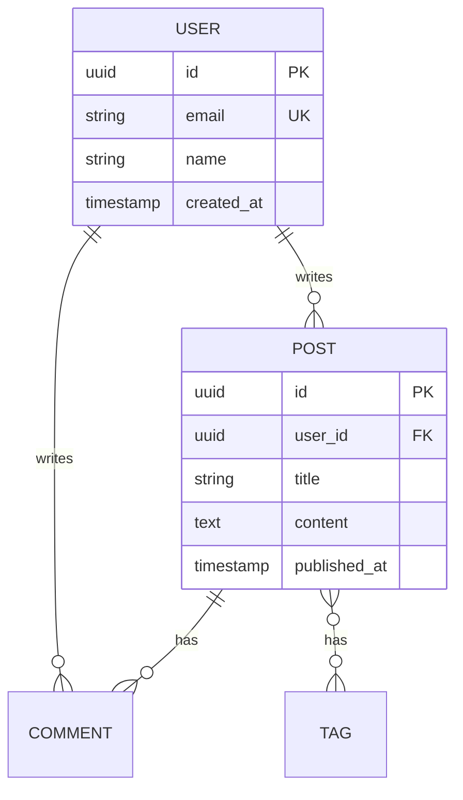

# Data Design Templates

Schema patterns and design templates for database modeling.

## Files

| Template | Purpose |
|----------|---------|
| `schema-patterns.sql` | Common database schema patterns |

## Schema Patterns

### 1. Hierarchical Data
For tree structures like categories, org charts, file systems.

```sql
-- Self-referencing with materialized path
CREATE TABLE categories (
    id UUID PRIMARY KEY,
    name VARCHAR(255),
    parent_id UUID REFERENCES categories(id),
    path TEXT  -- '/root/parent/child'
);
```

**Use when:** Categories, comments (threaded), org structure

### 2. Many-to-Many with Metadata
Junction tables that carry additional data.

```sql
CREATE TABLE user_roles (
    user_id UUID REFERENCES users(id),
    role_id UUID REFERENCES roles(id),
    granted_at TIMESTAMPTZ,
    expires_at TIMESTAMPTZ,
    PRIMARY KEY (user_id, role_id)
);
```

**Use when:** Role assignments, team memberships, enrollments

### 3. Polymorphic Associations
One table relating to multiple entity types.

```sql
-- Type + ID approach
commentable_type VARCHAR(50),  -- 'post', 'article'
commentable_id UUID

-- Or separate FKs with constraint
post_id UUID REFERENCES posts(id),
article_id UUID REFERENCES articles(id),
CONSTRAINT one_parent CHECK (...)
```

**Use when:** Comments, attachments, activity logs

### 4. Event Sourcing
Append-only event log for audit/replay.

```sql
CREATE TABLE events (
    stream_id UUID,
    event_type VARCHAR(100),
    version INTEGER,
    payload JSONB,
    created_at TIMESTAMPTZ
);
```

**Use when:** Audit requirements, undo/redo, analytics

### 5. Temporal Data
Time-based validity periods.

```sql
CREATE TABLE prices (
    product_id UUID,
    price DECIMAL,
    valid_from TIMESTAMPTZ,
    valid_to TIMESTAMPTZ
);
```

**Use when:** Price history, versioned data, SCD Type 2

### 6. EAV (Entity-Attribute-Value)
Dynamic attributes (use JSONB instead when possible).

```sql
-- Better: JSONB column
attributes JSONB DEFAULT '{}'
CREATE INDEX ON table USING GIN (attributes);
```

**Use when:** Highly dynamic attributes, user-defined fields

### 7. Tagging System
Flexible categorization.

```sql
CREATE TABLE tags (id, name, slug);
CREATE TABLE taggings (tag_id, taggable_type, taggable_id);
```

**Use when:** Content tagging, filtering, faceted search

### 8. Soft Delete
Archive instead of hard delete.

```sql
-- Option A: Flag
deleted_at TIMESTAMPTZ

-- Option B: Archive table
INSERT INTO posts_archive SELECT * FROM posts WHERE id = ?;
DELETE FROM posts WHERE id = ?;
```

**Use when:** Data recovery needs, audit requirements

## Design Guidelines

### Naming Conventions

| Type | Convention | Example |
|------|------------|---------|
| Tables | plural, snake_case | `user_profiles` |
| Columns | snake_case | `created_at` |
| PKs | `id` | `id UUID` |
| FKs | `{table}_id` | `user_id` |
| Indexes | `idx_{table}_{columns}` | `idx_users_email` |
| Constraints | `{table}_{type}_{desc}` | `users_email_unique` |

### Column Types

```sql
-- IDs
id UUID                    -- Distributed-friendly
id SERIAL                  -- Simple auto-increment

-- Strings
VARCHAR(n)                 -- Known max length
TEXT                       -- Unknown/large text

-- Numbers
INTEGER                    -- Whole numbers
DECIMAL(10, 2)            -- Money (exact)
REAL / DOUBLE PRECISION   -- Scientific (approximate)

-- Dates
TIMESTAMPTZ               -- Always use with timezone
DATE                      -- Date only
INTERVAL                  -- Duration

-- JSON
JSONB                     -- Prefer over JSON (indexed)

-- Boolean
BOOLEAN                   -- true/false
```

### Index Guidelines

```sql
-- Index columns used in:
-- - WHERE clauses
-- - JOIN conditions
-- - ORDER BY
-- - Foreign keys

-- Don't over-index:
-- - Small tables (<1000 rows)
-- - Frequently updated columns
-- - Low-cardinality columns (use partial index)
```

## ERD Notation (Mermaid)



Generate with: https://mermaid.live
