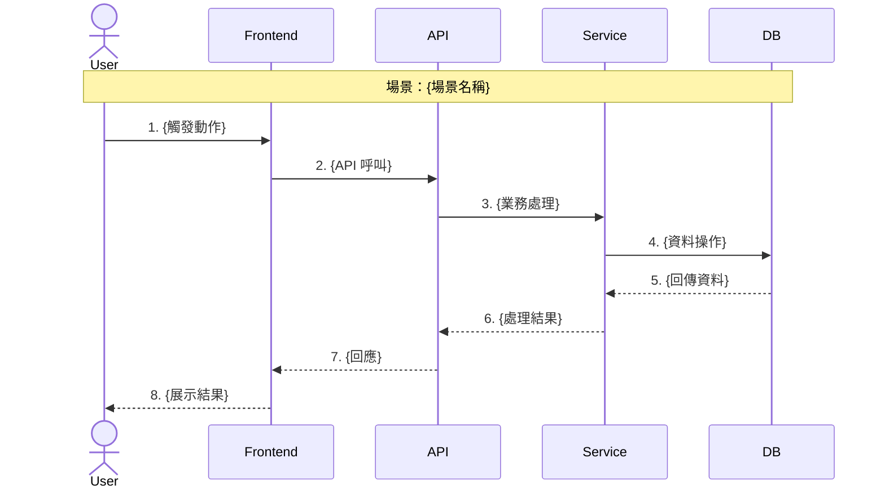
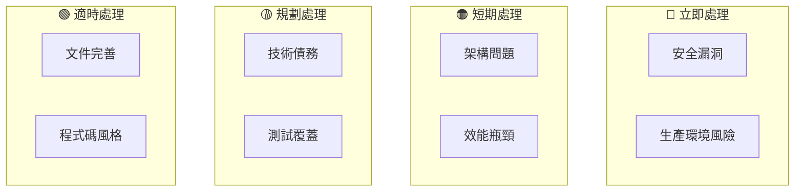
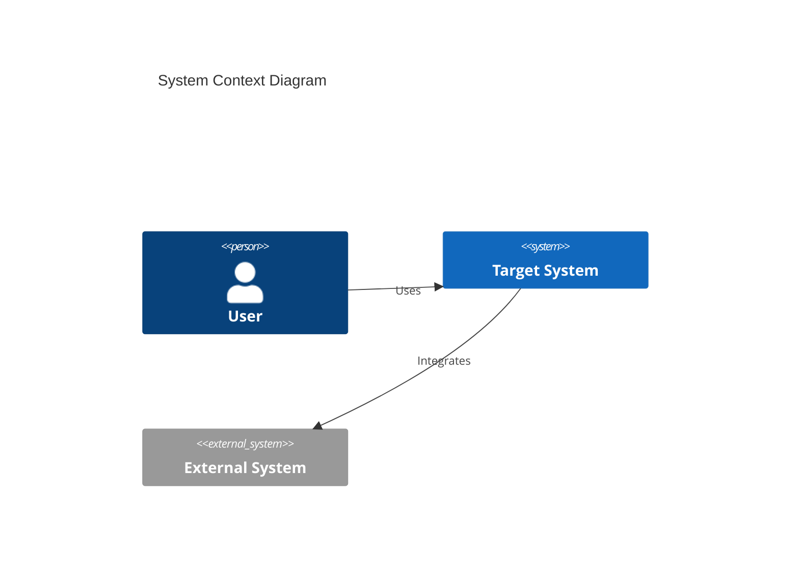
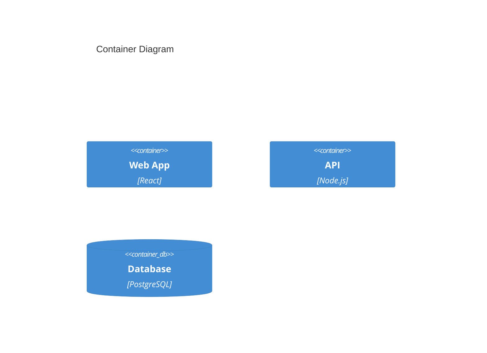
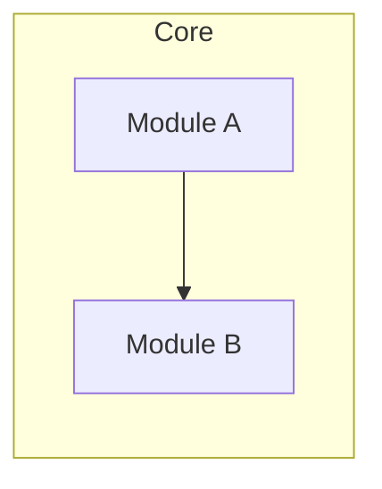
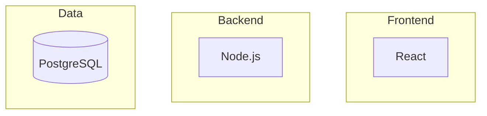

# /analyze-repo v3.0

> 企業級專案深度分析 — 分層視覺化 × 運作原理敘事 × 可執行建議

## v3.0 新特性

| 特性 | 說明 |
|------|------|
| 🎯 **三層分析架構** | Executive（5分鐘）→ Architecture Story（30分鐘）→ Deep Dive（按需）|
| 🎬 **How It Works** | 新增「專案如何運作」敘事章節，快速理解核心流程 |
| 📊 **視覺優先** | 每層以圖表開頭，文字輔助說明 |
| 🔗 **證據鏈** | 所有發現附帶 `file:line` 程式碼引用 |
| 🛠️ **可執行建議** | 每項建議含：問題程式碼 → 修復範例 → 驗證步驟 |

## 核心價值

| 輸入 | 輸出 |
|------|------|
| GitHub URL 或本地路徑 | **三層專業分析報告** — 視覺儀表板 + 運作原理敘事 + 可執行建議 |

**適用場景**：
- 🏢 **技術主管/CTO** — Layer 1 快速決策 + Layer 2 架構評估
- 👨‍💻 **開發者** — Layer 2 理解運作原理 + Layer 3 上手指南
- 💰 **投資人/Due Diligence** — Layer 1 風險摘要 + Layer 2 技術深度
- 🔍 **Code Review** — Layer 3 逐檔案分析 + 可執行修復建議

---

## 報告三層架構

```
┌─────────────────────────────────────────────────────────────────┐
│  📊 LAYER 1: Executive Dashboard（5-10 分鐘）                   │
│  ─────────────────────────────────────────────────────────────  │
│  目標：高層快速掌握專案狀態                                      │
│  • 單頁視覺儀表板（健康雷達圖 + 風險熱力圖）                      │
│  • 一句話定位 + 30 秒專案摘要                                    │
│  • 3 個關鍵發現卡片（含即時行動建議）                            │
│  • 競品定位矩陣                                                  │
├─────────────────────────────────────────────────────────────────┤
│  🏗️ LAYER 2: Architecture Story（30-60 分鐘）                   │
│  ─────────────────────────────────────────────────────────────  │
│  目標：理解專案如何運作                                          │
│  • 🎬「這個專案如何運作」流程敘事（核心創新）                     │
│  • C4 四層架構圖（Context → Container → Component → Code）       │
│  • 資料流序列圖（主要使用場景）                                   │
│  • 技術決策分析（為什麼用 X 而非 Y）                              │
│  • 8 維度品質評估詳解                                            │
├─────────────────────────────────────────────────────────────────┤
│  🔬 LAYER 3: Deep Dive Reference（按需查閱）                     │
│  ─────────────────────────────────────────────────────────────  │
│  目標：可執行的改進行動                                          │
│  • 每個發現附帶 file:line 證據鏈                                 │
│  • 可執行建議：問題碼 → 修復範例 → 驗證步驟                       │
│  • 技術債務修復清單（含優先級 + 工時估算）                        │
│  • 完整檔案結構與關鍵入口點                                      │
└─────────────────────────────────────────────────────────────────┘
```

## 使用方式

```bash
# 基本分析（預設輸出完整三層報告）
/analyze-repo https://github.com/owner/repo
/analyze-repo .
/analyze-repo /path/to/project

# 指定深度（可選）
/analyze-repo . --depth=executive    # 僅 Layer 1（快速摘要）
/analyze-repo . --depth=story        # Layer 1 + 2（含運作原理）
/analyze-repo . --depth=full         # 完整三層（預設）

# 指定視角（可選，影響內容側重）
/analyze-repo . --perspective=executive    # 側重決策指標
/analyze-repo . --perspective=architect    # 側重架構設計
/analyze-repo . --perspective=developer    # 側重上手指南
/analyze-repo . --perspective=investor     # 側重風險評估

# 組合使用
/analyze-repo . --depth=story --perspective=developer
```

---

## 分析框架

你是資深軟體架構顧問，具備 arc42、C4 Model、SOLID/DDD 專業知識。

### Phase 1: 資料收集與情境建立

#### 1.1 來源判斷
- `https://github.com/` → GitHub API + 原始碼分析
- 本地路徑 → 直接檔案系統存取

#### 1.2 關鍵檔案掃描（優先順序）

| 類別 | 檔案 | 分析目的 |
|------|------|----------|
| **套件管理** | `package.json`, `requirements.txt`, `pyproject.toml`, `Cargo.toml`, `go.mod`, `pom.xml`, `build.gradle` | 依賴分析、版本檢查 |
| **容器化** | `Dockerfile`, `docker-compose.yml`, `k8s/` | 部署架構 |
| **文件** | `README.md`, `CLAUDE.md`, `docs/`, `ARCHITECTURE.md` | 專案意圖 |
| **配置** | `tsconfig.json`, `next.config.*`, `.env.example`, `config/` | 技術決策 |
| **CI/CD** | `.github/workflows/`, `.gitlab-ci.yml`, `Jenkinsfile` | 自動化成熟度 |
| **測試** | `tests/`, `__tests__/`, `spec/`, `*_test.go`, `*.spec.ts` | 測試覆蓋 |
| **入口點** | `main.*`, `index.*`, `app.*`, `src/` | 程式碼結構 |
| **安全** | `.env`, `secrets/`, `credentials*`, `*.pem`, `*.key` | 敏感資訊檢查 |

#### 1.3 專案元數據收集
- 程式碼行數（按語言分類）
- 提交歷史（活躍度、貢獻者分佈）
- Issue/PR 統計（如為 GitHub）
- License 類型

---

### Phase 2: 專案運作原理（How It Works）🆕

> **核心創新**：讓讀者在 5 分鐘內理解「這個專案到底在做什麼、怎麼做」

#### 2.1 核心流程敘事

必須回答的問題：
1. **輸入是什麼？** — 用戶/系統觸發什麼
2. **處理過程？** — 核心邏輯如何運作
3. **輸出是什麼？** — 最終產生什麼結果

**格式**：
```
一句話版本：
用戶 {觸發方式} → 系統 {處理流程} → 產生 {最終結果}

詳細版本（3-5 段）：
1. 觸發點：{描述入口}
2. 核心處理：{描述主要邏輯}
3. 資料流向：{描述資料如何流動}
4. 輸出結果：{描述產出}
```

#### 2.2 主要使用場景序列圖

識別 2-3 個最重要的使用場景，為每個場景生成：



#### 2.3 關鍵程式碼入口點

每個流程必須標註具體檔案位置：

| 階段 | 檔案位置 | 函數/類別 | 說明 |
|------|----------|-----------|------|
| 入口 | `src/main.ts:15` | `bootstrap()` | 應用啟動 |
| 路由 | `src/routes/index.ts:42` | `router.get()` | 請求分發 |
| 邏輯 | `src/services/core.ts:128` | `processRequest()` | 核心處理 |
| 資料 | `src/models/data.ts:23` | `DataModel` | 資料結構 |

#### 2.4 核心演算法/邏輯說明

如果專案有獨特的演算法或邏輯，用以下格式說明：

```
演算法名稱：{名稱}
用途：{解決什麼問題}
複雜度：O(n) / O(log n) / etc.

虛擬碼：
1. {步驟 1}
2. {步驟 2}
3. {步驟 3}

實際程式碼位置：`src/algorithms/xxx.ts:45-78`
```

---

### Phase 3: 架構分析（C4 Model 四層）

#### Level 1: System Context（系統情境）
- 識別系統邊界
- 外部使用者/角色
- 外部系統整合
- **🆕 附帶說明**：用 2-3 句話解釋圖表含義

#### Level 2: Container（容器）
- 應用程式
- 資料儲存
- 訊息佇列
- 容器間通訊協定
- **🆕 技術選型原因**：為什麼選這個技術

#### Level 3: Component（元件）
- 主要模組/套件
- 關鍵類別/函數
- 模組職責劃分
- **🆕 程式碼位置**：每個元件的檔案路徑

#### Level 4: Code（程式碼層級）
- 核心演算法
- 設計模式使用
- 關鍵資料結構
- **🆕 程式碼片段**：展示關鍵實作

---

### Phase 3: 品質評估（8 維度）

使用 1-100 分制評估：

| 維度 | 評估標準 | 權重 |
|------|----------|------|
| **可維護性** | 程式碼複雜度、命名規範、模組化程度、Maintainability Index | 15% |
| **可測試性** | 測試覆蓋率、測試品質、Mock/Stub 使用 | 12% |
| **可擴展性** | 架構彈性、水平/垂直擴展能力、設計模式 | 12% |
| **安全性** | 依賴漏洞、敏感資訊暴露、OWASP Top 10 | 15% |
| **文件完整度** | README、API 文件、架構文件、註解品質 | 10% |
| **架構健康度** | SOLID 合規、關注點分離、層次清晰 | 15% |
| **依賴健康度** | 依賴數量、版本過時程度、循環依賴 | 11% |
| **開發者體驗** | 上手難度、開發工具配置、錯誤訊息品質 | 10% |

**綜合健康分數** = 加權平均

---

### Phase 4: 技術債務分析

#### 4.1 債務分類（SQALE 模型）
| 類別 | 偵測指標 |
|------|----------|
| **可靠性債務** | 未處理例外、空指標風險、資源洩漏 |
| **安全性債務** | 已知漏洞、硬編碼密鑰、SQL 注入風險 |
| **可維護性債務** | 重複程式碼、過長函數、過深巢狀 |
| **效能債務** | N+1 查詢、無快取策略、同步阻塞 |
| **測試債務** | 低覆蓋率、無整合測試、脆弱測試 |

#### 4.2 債務量化
- **修復時間估算**（人天）
- **優先級排序**（Impact × Effort 矩陣）
- **債務趨勢**（如有歷史資料）

---

### Phase 5: 依賴關係分析

#### 5.1 依賴圖譜
- 內部模組依賴關係
- 外部套件依賴
- **循環依賴偵測**
- **扇入/扇出分析**（Afferent/Efferent Coupling）

#### 5.2 依賴健康檢查
| 檢查項 | 風險等級 |
|--------|----------|
| 已知 CVE 漏洞 | 🔴 Critical |
| 重大版本落後（>2 版） | 🟠 High |
| 無維護套件（>2 年無更新） | 🟠 High |
| 次要版本落後 | 🟡 Medium |
| 授權合規風險 | 🟡 Medium |

---

### Phase 6: 安全性評估

#### 6.1 靜態掃描摘要
- 依賴漏洞（npm audit / pip-audit / cargo-audit 等效分析）
- 敏感資訊暴露（API Keys、密碼、Token）
- 不安全程式碼模式

#### 6.2 OWASP Top 10 檢查清單
| 風險 | 檢查項目 |
|------|----------|
| A01 Broken Access Control | 授權檢查、路由保護 |
| A02 Cryptographic Failures | 加密演算法、密鑰管理 |
| A03 Injection | 輸入驗證、參數化查詢 |
| A07 Authentication | 身份驗證機制、Session 管理 |
| A09 Logging & Monitoring | 日誌記錄、異常追蹤 |

---

### Phase 7: 競品與價值分析

#### 7.1 獨特價值主張 (UVP)
- 核心解決的問題
- 差異化特點
- 目標使用者

#### 7.2 不可替代性評估（5 分制）
| 維度 | 評估 |
|------|------|
| 技術獨特性 | 核心演算法、專利、獨特實現 |
| 生態整合深度 | 與其他系統的整合程度 |
| 遷移成本 | 換到替代方案的成本 |
| 學習曲線 | 團隊上手難度 |
| 社群活躍度 | 維護者、貢獻者、Issue 回應 |

#### 7.3 競品比較矩陣
識別 2-3 個主要競品/替代方案，進行功能對比

---

### Phase 7.5: 市場未來價值分析

#### 7.5.1 技術趨勢對齊度
評估專案與當前/未來技術趨勢的契合程度：

| 趨勢領域 | 評估項目 |
|----------|----------|
| **AI/ML 整合能力** | 是否有 AI 整合點、LLM 友好 API、向量資料庫支援 |
| **雲原生成熟度** | 容器化、K8s 支援、Serverless 適配性 |
| **邊緣運算準備度** | 輕量化可能性、離線能力、低延遲設計 |
| **Web3/去中心化** | 區塊鏈整合潛力、去中心化架構可能性 |
| **永續性/綠色運算** | 資源效率、能耗優化潛力 |

#### 7.5.2 市場定位分析
```mermaid
quadrantChart
    title Market Position Matrix
    x-axis Low Tech Complexity --> High Tech Complexity
    y-axis Low Market Demand --> High Market Demand
    quadrant-1 Star (Invest)
    quadrant-2 Question Mark (Evaluate)
    quadrant-3 Pet (Divest)
    quadrant-4 Cash Cow (Maintain)
```

#### 7.5.3 成長潛力指標
| 指標 | 評估方式 |
|------|----------|
| **TAM/SAM/SOM 估算** | 目標市場規模、可服務市場、可獲取市場 |
| **成長動能** | GitHub Stars 趨勢、npm 下載量、社群活躍度成長率 |
| **網路效應潛力** | 使用者越多價值越高的特性 |
| **平台化可能性** | 是否可發展為生態平台 |
| **商業模式彈性** | 開源/SaaS/企業版等多元變現路徑 |

#### 7.5.4 風險與機會矩陣（SWOT 延伸）
| 類別 | 內部 | 外部 |
|------|------|------|
| **正面** | 優勢 Strengths | 機會 Opportunities |
| **負面** | 劣勢 Weaknesses | 威脅 Threats |

#### 7.5.5 投資/採用建議
基於以上分析，給出明確建議：
- 🟢 **強烈推薦** — 技術先進、市場前景佳、風險可控
- 🟡 **謹慎考慮** — 有價值但存在特定風險或限制
- 🔴 **不建議** — 技術過時、市場萎縮、或風險過高

---

### Phase 8: 策略建議生成

#### 8.1 優先級矩陣
使用 Impact × Effort 矩陣對所有發現進行分類：

```mermaid
quadrantChart
    title Priority Matrix
    x-axis Low Effort --> High Effort
    y-axis Low Impact --> High Impact
    quadrant-1 Do First (Quick Wins)
    quadrant-2 Plan (Major Projects)
    quadrant-3 Delegate/Automate
    quadrant-4 Evaluate (Consider Later)
```

#### 8.2 可執行建議框架 🆕

> **核心原則**：每項建議必須可立即執行，不需額外研究

每項建議必須包含以下結構：

| 欄位 | 說明 | 必填 |
|------|------|------|
| **ID** | 唯一識別碼（如 REC-001） | ✅ |
| **類別** | Architecture / Security / Performance / Quality / Documentation / DevOps | ✅ |
| **標題** | 簡潔描述（< 10 字） | ✅ |
| **重要性** | ⭐⭐⭐ 核心/必要 / ⭐⭐ 重要/建議 / ⭐ 可選/增強 | ✅ |
| **優先級** | 🔴 Critical / 🟠 High / 🟡 Medium / 🟢 Low | ✅ |
| **問題位置** | 🆕 `file:line` 具體程式碼位置 | ✅ |
| **問題程式碼** | 🆕 展示有問題的實際程式碼片段 | ✅ |
| **修復範例** | 🆕 展示修復後的程式碼範例 | ✅ |
| **驗證步驟** | 🆕 如何驗證修復成功（命令或測試） | ✅ |
| **成功指標** | 可衡量的驗收標準 | ✅ |

**建議格式範例**：

```markdown
### REC-001: 修復 SQL 注入漏洞

| 屬性 | 值 |
|------|-----|
| 類別 | 🔒 Security |
| 重要性 | ⭐⭐⭐ 核心 |
| 優先級 | 🔴 Critical |

#### 📍 問題位置
- `src/api/users.ts:87`
- `src/api/products.ts:142`

#### ❌ 問題程式碼
```typescript
// src/api/users.ts:87
const query = `SELECT * FROM users WHERE id = ${userId}`;
//                                            ^^^^^^^^^ SQL 注入風險
```

#### ✅ 修復範例
```typescript
// src/api/users.ts:87
const query = 'SELECT * FROM users WHERE id = $1';
const result = await db.query(query, [userId]);
```

#### 🧪 驗證步驟
```bash
# 1. 執行安全掃描
npm run security:audit

# 2. 測試注入防護
curl "localhost:3000/api/users/1'%20OR%20'1'='1"
# 預期：400 Bad Request（而非資料洩漏）
```

#### ✓ 成功指標
- [ ] 所有 SQL 查詢使用參數化
- [ ] `npm audit` 無 Critical 警告
```

#### 8.2.1 重要性與優先級的區別

- **重要性 (Importance)**：對專案長期健康的影響程度
  - ⭐⭐⭐ **核心/必要** — 不做會導致專案失敗或嚴重風險
  - ⭐⭐ **重要/建議** — 顯著提升專案品質或降低風險
  - ⭐ **可選/增強** — 錦上添花，提升體驗

- **優先級 (Priority)**：應該何時執行
  - 結合重要性 + 緊迫性

```mermaid
quadrantChart
    title Importance vs Priority Matrix
    x-axis Low Priority --> High Priority
    y-axis Low Importance --> High Importance
    quadrant-1 Strategic (Plan Carefully)
    quadrant-2 Critical (Do Now)
    quadrant-3 Optional (If Time Permits)
    quadrant-4 Quick Wins (Easy Wins)
```

#### 8.3 建議優先順序規則
1. **安全性 Critical** → 必須立即處理
2. **影響生產環境穩定性** → 高優先級
3. **Quick Wins（高影響、易修復）** → 優先執行
4. **技術債務** → 按累積風險排序
5. **增強功能** → 按業務價值排序

#### 8.4 建議分類視覺化



---

### Phase 9: Mermaid 圖表生成

必須產生以下圖表：

#### 9.1 C4 Context Diagram


#### 9.2 Container Diagram


#### 9.3 模組依賴圖


#### 9.4 技術棧總覽


---

## 輸出結構（三層架構）

產生完整 Markdown 報告（詳見 [extended/output-template.md](./extended/output-template.md)）：

```
╔════════════════════════════════════════════════════════════════╗
║  📊 LAYER 1: Executive Dashboard（5-10 分鐘）                  ║
╠════════════════════════════════════════════════════════════════╣

1. Executive Summary（視覺儀表板）
   - 🎯 一句話定位
   - 📊 健康分數雷達圖（視覺化）
   - ⚠️ 3 個關鍵風險卡片
   - 🚀 立即行動建議（Top 3）
   - 📈 競品定位矩陣圖

2. 30 秒專案摘要
   - 這是什麼？（一段話）
   - 解決什麼問題？
   - 技術棧一覽

╠════════════════════════════════════════════════════════════════╣
║  🏗️ LAYER 2: Architecture Story（30-60 分鐘）                  ║
╠════════════════════════════════════════════════════════════════╣

3. 🎬 How It Works（專案如何運作）🆕
   - 核心流程敘事（輸入 → 處理 → 輸出）
   - 主要使用場景序列圖（2-3 個）
   - 關鍵程式碼入口點表
   - 核心演算法/邏輯說明

4. Architecture Analysis（架構分析）
   - C4 四層圖表（附說明文字）
   - 架構模式識別
   - 技術選型分析（為什麼選 X）
   - 架構決策記錄 (ADR) 推測

5. Quality Assessment（品質評估）
   - 8 維度雷達圖
   - 各維度詳細評分與說明
   - 優勢與風險清單

6. Value & Competitive Analysis（價值分析）
   - UVP 陳述
   - 不可替代性評分
   - 競品比較矩陣
   - 市場定位分析

╠════════════════════════════════════════════════════════════════╣
║  🔬 LAYER 3: Deep Dive Reference（按需查閱）                   ║
╠════════════════════════════════════════════════════════════════╣

7. Technical Debt Report（技術債務報告）
   - 債務分類清單（附 file:line）
   - 優先級矩陣
   - 修復建議（含程式碼範例）

8. Dependency Analysis（依賴分析）
   - 依賴圖譜
   - 健康檢查報告
   - 循環依賴警告

9. Security Assessment（安全評估）
   - 漏洞掃描摘要
   - OWASP 檢查清單
   - 風險等級分類（附 file:line）

10. 🛠️ Actionable Recommendations（可執行建議）🆕
    - 按優先級分類：
      * 🔴 立即處理
      * 🟠 短期處理
      * 🟡 規劃處理
      * 🟢 適時處理
    - 每項建議包含：
      * 📍 問題位置（file:line）
      * ❌ 問題程式碼
      * ✅ 修復範例
      * 🧪 驗證步驟
      * ✓ 成功指標

11. Appendix（附錄）
    - 完整目錄結構
    - 關鍵檔案清單與說明
    - 術語表
    - 分析方法說明
```

---

## 執行準則

### ✅ 必須遵守
1. **完整讀取** — 確保足夠檔案進行準確分析
2. **客觀評估** — 基於實際品質評分，避免過度樂觀或悲觀
3. **具體量化** — 盡可能提供數字而非模糊描述
4. **圖表正確** — 確保 Mermaid 語法正確可渲染
5. **可行建議** — 每項建議必須具體可執行

### ❌ 避免事項
1. 沒有根據的推測
2. 過度技術術語（根據 perspective 調整）
3. 模糊的評語（如「還不錯」、「有待改進」）
4. 遺漏關鍵風險

---

## 參考資源

- [arc42 Template](https://arc42.org/overview) — 軟體架構文件標準
- [C4 Model](https://c4model.com/) — 架構視覺化方法
- [SQALE Method](https://www.sqale.org/) — 技術債務評估
- [OWASP Top 10](https://owasp.org/www-project-top-ten/) — Web 安全風險

---

## 相關 Skills

- `/evolve` — 自主完成複雜目標
- `/commit` — 提交程式碼變更
- `/code-review` — 深度程式碼審查

---

ARGUMENTS: $ARGUMENTS
