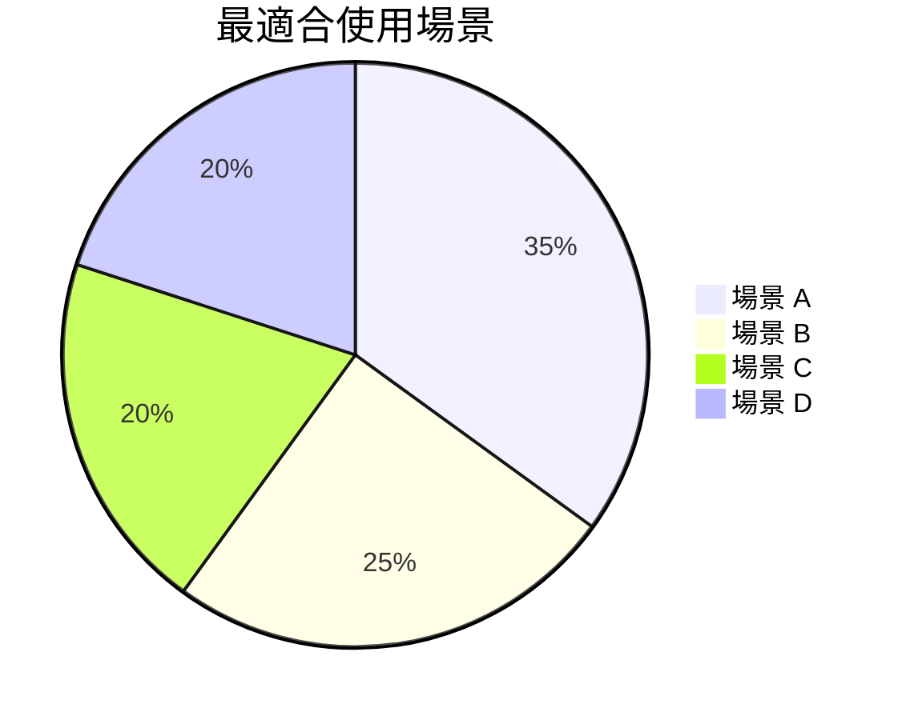
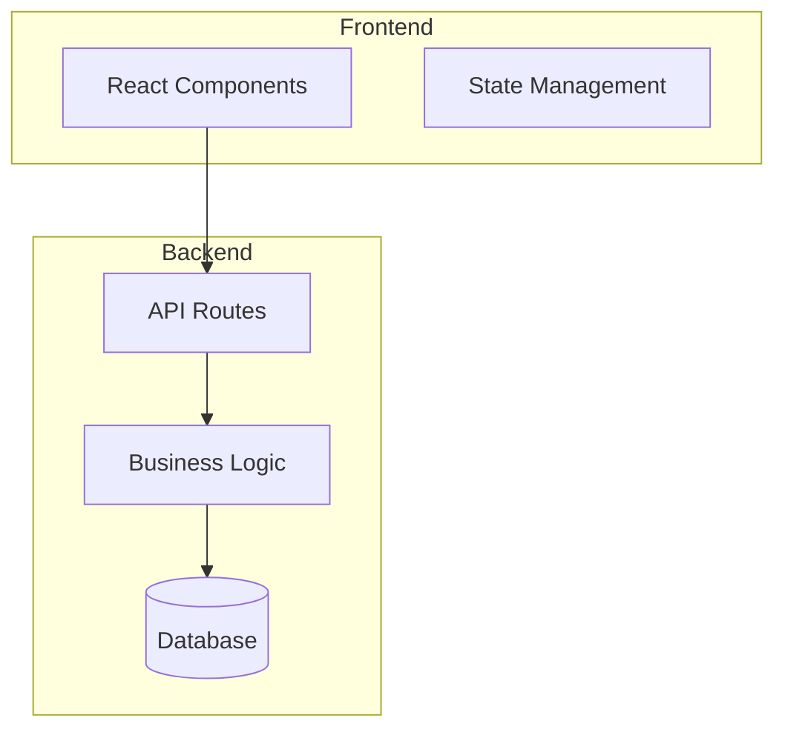
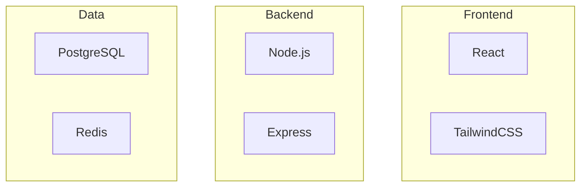
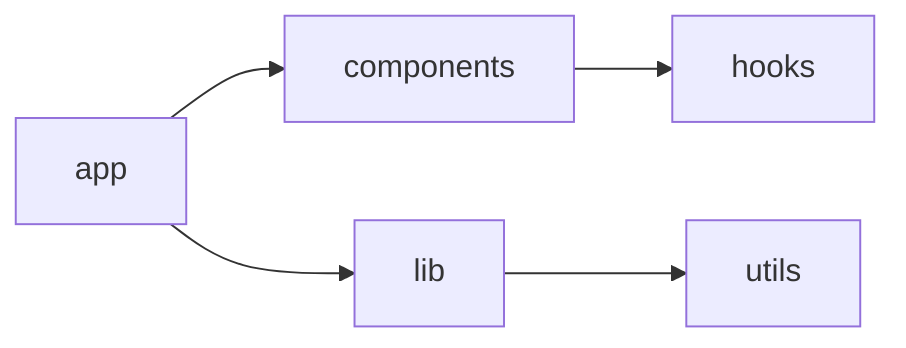

# 輸出模板

完整的 Markdown 報告模板：

```markdown
# 專案分析報告：{專案名稱}

> 分析日期：{YYYY-MM-DD}
> 分析工具：Claude Code analyze-repo Skill

---

## 1. 專案概覽

| 項目 | 內容 |
|------|------|
| 名稱 | {name} |
| 描述 | {description} |
| 主要語言 | {language} |
| GitHub Stars | {stars} |
| 授權 | {license} |

### 一句話總結

{用一句話描述這個專案的核心功能和特色}

---

## 2. 技術棧

### 語言與框架

| 類別 | 技術 |
|------|------|
| 程式語言 | {languages} |
| 框架 | {frameworks} |
| 建置工具 | {build tools} |
| 測試框架 | {test frameworks} |
| 資料庫 | {databases} |

### 技術棧總覽圖

```mermaid
flowchart TB
    subgraph Frontend
        {frontend_tech}
    end
    subgraph Backend
        {backend_tech}
    end
    subgraph Data
        {data_tech}
    end
```

---

## 3. 架構分析

### 架構模式

**{架構模式名稱}**

{架構描述}

### 主要元件

| 元件 | 職責 |
|------|------|
| {component1} | {responsibility1} |
| {component2} | {responsibility2} |

### 架構圖

```mermaid
flowchart TB
    {architecture_diagram}
```

### 目錄結構

```
{專案名稱}/
├── src/
│   ├── components/    # UI 元件
│   └── lib/           # 工具函數
├── package.json
└── README.md
```

---

## 4. 程式碼品質評估

### 綜合評分：{score}/100

```
結構清晰度  ████████░░  {score1}/100
可維護性    ███████░░░  {score2}/100
測試覆蓋    ██████░░░░  {score3}/100
文件品質    █████████░  {score4}/100
安全性      ███████░░░  {score5}/100
```

### 優點

- {strength1}
- {strength2}
- {strength3}

### 待改進項目

- {concern1}
- {concern2}
- {concern3}

---

## 5. 改進建議

### 高優先級

#### {建議標題}

**類別**: {category} | **優先級**: HIGH

{詳細說明}

**行動項目**:
1. {action1}
2. {action2}

### 中優先級

{...}

### 低優先級

{...}

---

## 6. 價值評估

### 專案解決的問題

| 問題 | 說明 |
|------|------|
| {problem1} | {description1} |
| {problem2} | {description2} |

### 獨特價值主張 (UVP)

**「{一句話 UVP}」**

核心價值：
1. {value1}
2. {value2}
3. {value3}

### 不可替代性評估

| 維度 | 評分 | 說明 |
|------|------|------|
| **技術獨特性** | ★★★★☆ | {說明} |
| **遷移成本** | ★★★☆☆ | {說明} |
| **社群生態** | ★★★★☆ | {說明} |
| **學習曲線** | ★★★☆☆ | {說明} |
| **持續演進** | ★★★★★ | {說明} |

**綜合不可替代性分數：{X.X}/5**

### 競品比較

| 特性 | 本專案 | 競品 A | 競品 B |
|------|--------|--------|--------|
| {feature1} | ✅ | ⚠️ | ❌ |
| {feature2} | ✅ | ✅ | ⚠️ |
| {feature3} | ⚠️ | ✅ | ✅ |

### 適用場景



### 採用建議

| 情境 | 建議 |
|------|------|
| {scenario1} | ✅ 推薦 — {原因} |
| {scenario2} | ⚠️ 可能 — {原因} |
| {scenario3} | ❌ 不適用 — {原因} |

---

## 7. 建議下一步

1. {next step 1}
2. {next step 2}
3. {next step 3}

---

## 8. 推薦資源

- [{resource title}]({url}) - {description}
- [{resource title}]({url}) - {description}

---

## 附錄：模組關係圖

```mermaid
flowchart LR
    {module_diagram}
```

---

*此報告由 Claude Code analyze-repo Skill 自動產生*
```

## Mermaid 圖表範例

### 架構圖範例



### 技術棧圖範例



### 模組關係圖範例



## 分數條生成

使用以下格式產生視覺化分數條：

```
█ = 10 分
░ = 空位

80/100 = ████████░░
70/100 = ███████░░░
60/100 = ██████░░░░
90/100 = █████████░
```
