# 輸出模板 v3.0

> 三層架構：Executive Dashboard → Architecture Story → Deep Dive Reference

完整的 Markdown 報告模板：

```markdown
# 專案分析報告：{專案名稱}

> 分析日期：{YYYY-MM-DD}
> 分析版本：v3.0
> 分析工具：Claude Code analyze-repo Skill

---

# 📊 LAYER 1: Executive Dashboard

> 預計閱讀時間：5-10 分鐘

---

## 1. Executive Summary

### 一句話定位

> {用一句話描述這個專案的核心功能、目標使用者和獨特價值}

### 健康分數總覽

```
綜合健康分數：{score}/100  {健康等級}

可維護性      ████████░░  {score1}/100
可測試性      ███████░░░  {score2}/100
可擴展性      ██████░░░░  {score3}/100
安全性        █████████░  {score4}/100
文件完整度    ███████░░░  {score5}/100
架構健康度    ████████░░  {score6}/100
依賴健康度    ██████░░░░  {score7}/100
開發者體驗    ███████░░░  {score8}/100
```

### 關鍵發現（Top 5）

| # | 發現 | 影響 | 緊急度 |
|---|------|------|--------|
| 1 | {finding1} | {impact} | 🔴 |
| 2 | {finding2} | {impact} | 🟠 |
| 3 | {finding3} | {impact} | 🟠 |
| 4 | {finding4} | {impact} | 🟡 |
| 5 | {finding5} | {impact} | 🟢 |

### 立即行動建議

1. 🔴 **{action1}** — {原因} → [詳見 REC-001](#rec-001)
2. 🟠 **{action2}** — {原因} → [詳見 REC-002](#rec-002)
3. 🟡 **{action3}** — {原因} → [詳見 REC-003](#rec-003)

---

## 2. 30 秒專案摘要

### 這是什麼？

> {一段話描述專案的本質和目的}

### 解決什麼問題？

| 問題 | 本專案的解法 |
|------|--------------|
| {problem1} | {solution1} |
| {problem2} | {solution2} |

### 技術棧一覽

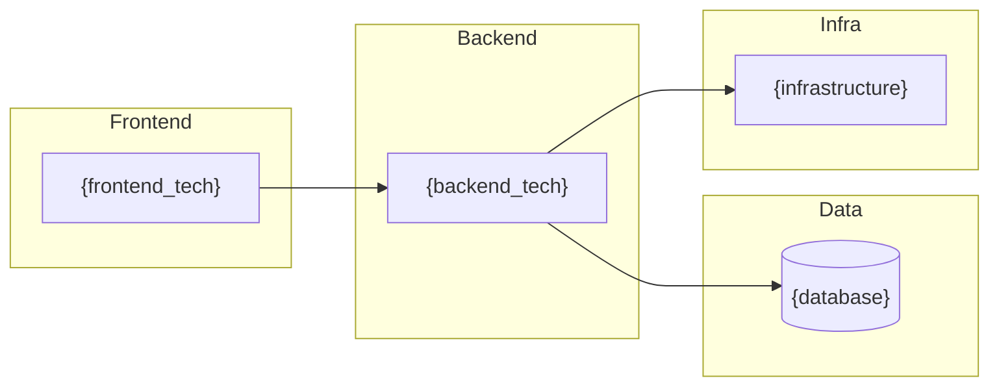

### 競品定位

```mermaid
quadrantChart
    title 競品定位矩陣
    x-axis 低複雜度 --> 高複雜度
    y-axis 低市場需求 --> 高市場需求
    quadrant-1 明星產品
    quadrant-2 潛力股
    quadrant-3 邊緣產品
    quadrant-4 現金牛
    "{本專案}": [{x}, {y}]
    "{競品A}": [{x}, {y}]
    "{競品B}": [{x}, {y}]
```

---

# 🏗️ LAYER 2: Architecture Story

> 預計閱讀時間：30-60 分鐘

---

## 3. 🎬 How It Works（專案如何運作）

### 核心流程敘事

**一句話版本**：
> 用戶 {觸發方式} → 系統 {處理流程} → 產生 {最終結果}

**詳細說明**：

{2-3 段話描述專案核心運作邏輯}

### 主要使用場景

#### 場景 1: {場景名稱}

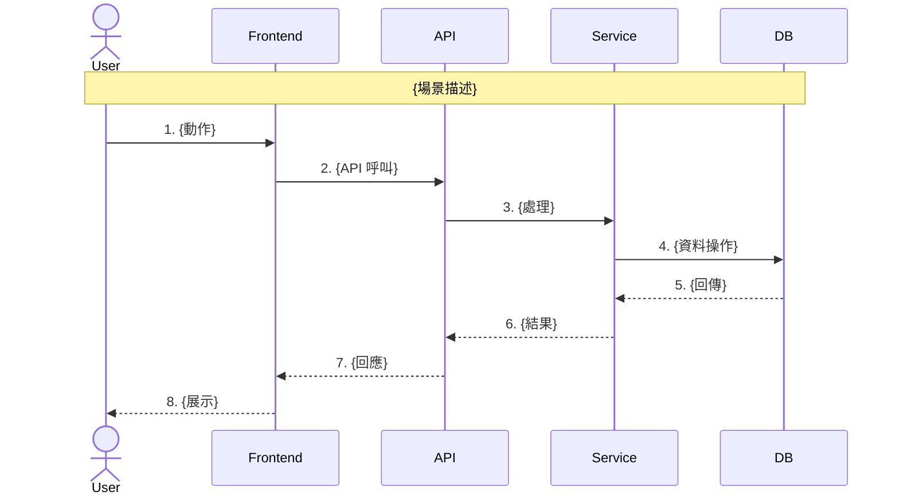

#### 場景 2: {場景名稱}

```mermaid
sequenceDiagram
    {類似格式}
```

### 關鍵程式碼入口點

| 階段 | 檔案位置 | 函數/類別 | 職責 |
|------|----------|-----------|------|
| 🚪 入口 | `{file}:{line}` | `{function}` | {說明} |
| 🛣️ 路由 | `{file}:{line}` | `{function}` | {說明} |
| ⚙️ 邏輯 | `{file}:{line}` | `{function}` | {說明} |
| 💾 資料 | `{file}:{line}` | `{class}` | {說明} |

### 核心演算法/邏輯

**{演算法名稱}**

用途：{解決什麼問題}

```
虛擬碼：
1. {步驟 1}
2. {步驟 2}
3. {步驟 3}
```

實際程式碼位置：`{file}:{start_line}-{end_line}`

---

## 4. Project Overview

### 基本資訊

| 項目 | 內容 |
|------|------|
| 專案名稱 | {name} |
| 描述 | {description} |
| 主要語言 | {language} ({percentage}%) |
| 程式碼行數 | {total_loc} |
| 授權 | {license} |
| 建立時間 | {created_at} |
| 最後更新 | {updated_at} |
| GitHub Stars | {stars} |
| Contributors | {contributors_count} |

### 技術棧摘要

| 類別 | 技術 | 版本 |
|------|------|------|
| 程式語言 | {languages} | {versions} |
| 框架 | {frameworks} | {versions} |
| 建置工具 | {build_tools} | {versions} |
| 測試框架 | {test_frameworks} | {versions} |
| 資料庫 | {databases} | {versions} |
| 基礎設施 | {infra} | - |

### 專案生命週期階段

```mermaid
flowchart LR
    A[🌱 初創] --> B[📈 成長]
    B --> C[🏢 成熟]
    C --> D[🔧 維護]
    D --> E[📉 衰退]

    style {current_stage} fill:#4CAF50,color:#fff
```

**當前階段**: {stage_name}
**判斷依據**: {stage_reason}

---

## 5. Architecture Analysis

### 5.1 System Context Diagram (C4 Level 1)

> **圖表說明**：{2-3 句話解釋這張圖在說什麼}

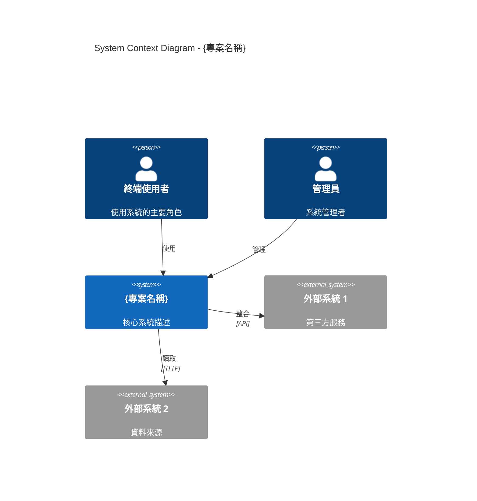

### 5.2 Container Diagram (C4 Level 2)

> **圖表說明**：{2-3 句話解釋這張圖在說什麼}

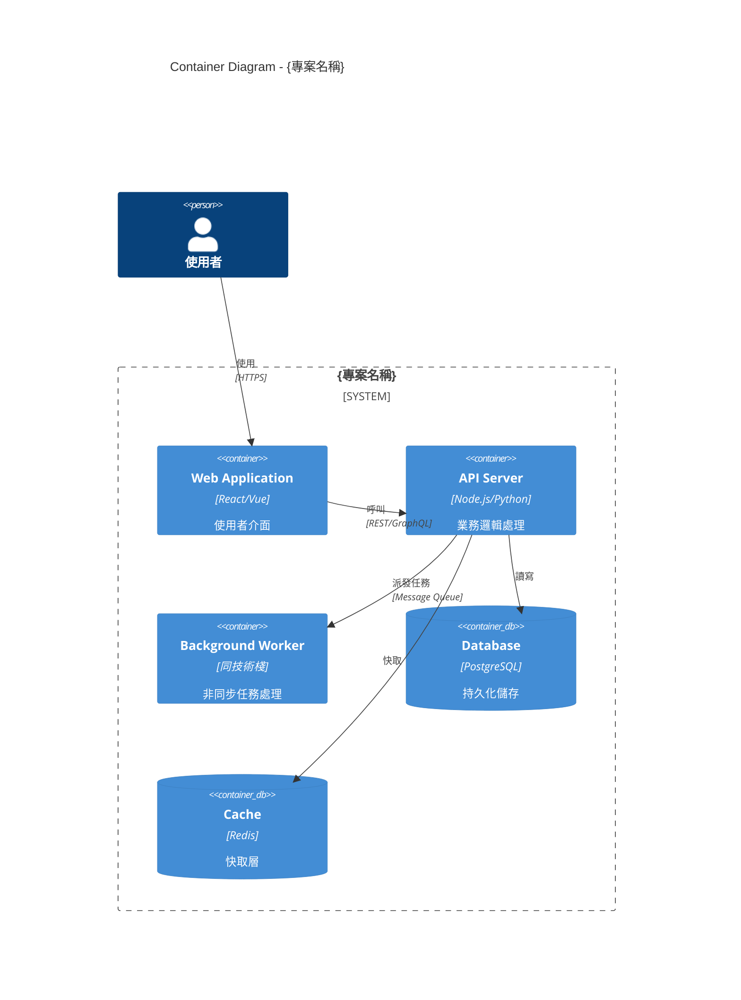

### 5.3 Component Diagram (C4 Level 3)

> **圖表說明**：{2-3 句話解釋這張圖在說什麼}

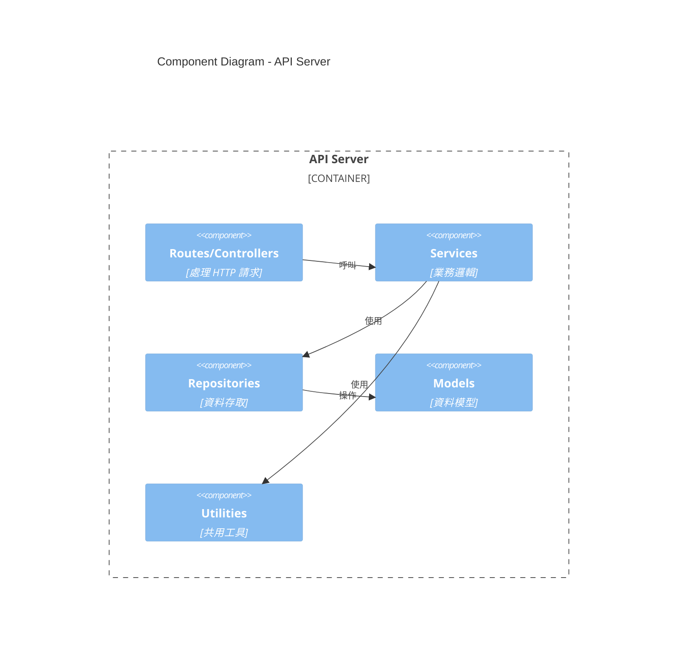

### 5.4 架構模式識別

**主要架構模式**: {pattern_name}

| 模式 | 說明 | 符合度 |
|------|------|--------|
| {pattern1} | {description} | ✅ 高 |
| {pattern2} | {description} | ⚠️ 部分 |
| {pattern3} | {description} | ❌ 無 |

### 5.5 主要元件與職責

| 元件 | 路徑 | 職責 | 依賴 |
|------|------|------|------|
| {component1} | `src/{path}` | {responsibility} | {deps} |
| {component2} | `src/{path}` | {responsibility} | {deps} |

### 5.6 技術選型分析 🆕

> **為什麼選這些技術？**

| 技術 | 選擇 | 為什麼選它 | 替代方案 |
|------|------|------------|----------|
| 語言 | {lang} | {reason} | {alternatives} |
| 框架 | {framework} | {reason} | {alternatives} |
| 資料庫 | {db} | {reason} | {alternatives} |
| 部署 | {deploy} | {reason} | {alternatives} |

### 5.7 架構決策記錄 (ADR) 推測

| ADR | 決策 | 可能原因 | 影響 |
|-----|------|----------|------|
| ADR-001 | 選用 {framework} | {reason} | {impact} |
| ADR-002 | 採用 {pattern} | {reason} | {impact} |

### 5.8 目錄結構

```
{專案名稱}/
├── src/                    # 原始碼
│   ├── components/         # UI 元件
│   ├── services/           # 業務邏輯
│   ├── models/             # 資料模型
│   └── utils/              # 工具函數
├── tests/                  # 測試
├── docs/                   # 文件
├── config/                 # 配置
└── package.json            # 套件管理
```

---

## 6. Quality Assessment

### 6.1 八維度雷達圖


### 6.2 各維度詳細評分

#### 6.2.1 可維護性 ({score1}/100)

| 指標 | 評分 | 說明 |
|------|------|------|
| 程式碼複雜度 | {sub_score} | Cyclomatic Complexity 平均值 |
| 命名規範 | {sub_score} | 一致性與可讀性 |
| 模組化程度 | {sub_score} | 單一職責原則遵守 |
| 重複程式碼 | {sub_score} | DRY 原則遵守 |

**優勢**: {strengths}
**風險**: {risks}

#### 6.2.2 可測試性 ({score2}/100)

| 指標 | 評分 | 說明 |
|------|------|------|
| 測試覆蓋率 | {coverage}% | 程式碼覆蓋百分比 |
| 測試品質 | {sub_score} | 測試案例有效性 |
| Mock 使用 | {sub_score} | 依賴隔離程度 |

#### 6.2.3 可擴展性 ({score3}/100)

| 指標 | 評分 | 說明 |
|------|------|------|
| 架構彈性 | {sub_score} | 新增功能的難易度 |
| 水平擴展 | {sub_score} | 多實例部署能力 |
| 設計模式 | {sub_score} | 擴展性模式使用 |

#### 6.2.4 安全性 ({score4}/100)

| 指標 | 評分 | 說明 |
|------|------|------|
| 依賴漏洞 | {sub_score} | CVE 數量與嚴重度 |
| 敏感資訊 | {sub_score} | 暴露風險 |
| 輸入驗證 | {sub_score} | 注入攻擊防護 |

#### 6.2.5 文件完整度 ({score5}/100)

| 指標 | 評分 | 說明 |
|------|------|------|
| README | {sub_score} | 專案說明品質 |
| API 文件 | {sub_score} | 介面文件 |
| 程式碼註解 | {sub_score} | 內部文件 |

#### 6.2.6 架構健康度 ({score6}/100)

| 指標 | 評分 | 說明 |
|------|------|------|
| SOLID 合規 | {sub_score} | 設計原則遵守 |
| 關注點分離 | {sub_score} | 層次清晰度 |
| 依賴方向 | {sub_score} | 依賴規則遵守 |

#### 6.2.7 依賴健康度 ({score7}/100)

| 指標 | 評分 | 說明 |
|------|------|------|
| 依賴數量 | {sub_score} | 直接依賴數 |
| 版本更新 | {sub_score} | 過時依賴比例 |
| 循環依賴 | {sub_score} | 循環依賴數量 |

#### 6.2.8 開發者體驗 ({score8}/100)

| 指標 | 評分 | 說明 |
|------|------|------|
| 上手難度 | {sub_score} | 新人 onboarding 時間 |
| 開發工具 | {sub_score} | 工具配置完整性 |
| 錯誤訊息 | {sub_score} | 錯誤可讀性 |

### 6.3 優勢與風險摘要

#### 優勢 ✅
1. {strength1}
2. {strength2}
3. {strength3}

#### 風險 ⚠️
1. {risk1}
2. {risk2}
3. {risk3}

---

## 7. Value & Competitive Analysis

### 7.1 專案解決的問題

| 問題 | 痛點程度 | 現有解決方案 | 本專案優勢 |
|------|----------|--------------|------------|
| {problem1} | 🔴 高 | {alternatives} | {advantage} |
| {problem2} | 🟠 中 | {alternatives} | {advantage} |

### 7.2 獨特價值主張 (UVP)

> **「{一句話 UVP}」**

核心價值：
1. **{value1}** — {description}
2. **{value2}** — {description}
3. **{value3}** — {description}

### 7.3 不可替代性評估

| 維度 | 評分 | 說明 |
|------|------|------|
| 技術獨特性 | ★★★★☆ | {說明} |
| 生態整合深度 | ★★★☆☆ | {說明} |
| 遷移成本 | ★★★★☆ | {說明} |
| 學習曲線 | ★★★☆☆ | {說明} |
| 社群活躍度 | ★★★★★ | {說明} |

**綜合不可替代性分數：{X.X}/5**

### 7.4 競品比較矩陣

> **詳細比較 3-6 個主要競品/替代方案**

| 維度 | 本專案 | {競品A} | {競品B} | {競品C} |
|------|--------|---------|---------|---------|
| **核心功能** | {描述} | {描述} | {描述} | {描述} |
| **技術架構** | {描述} | {描述} | {描述} | {描述} |
| **擴展性** | ✅ 插件系統 | ⚠️ 有限 | ❌ 無 | ✅ 完整 |
| **學習曲線** | 🟡 中等 | 🟢 低 | 🔴 高 | 🟡 中等 |
| **社群活躍度** | ⭐⭐⭐⭐ | ⭐⭐⭐⭐⭐ | ⭐⭐ | ⭐⭐⭐ |
| **授權方式** | MIT | Apache-2.0 | GPL-3.0 | 商業 |
| **最後更新** | {日期} | {日期} | {日期} | {日期} |

**選擇建議**：
- 選 **本專案** 如果：{適用場景}
- 選 **{競品A}** 如果：{適用場景}
- 選 **{競品B}** 如果：{適用場景}

### 7.5 適用場景分析

> **用餅圖呈現最適合的使用場景佔比**

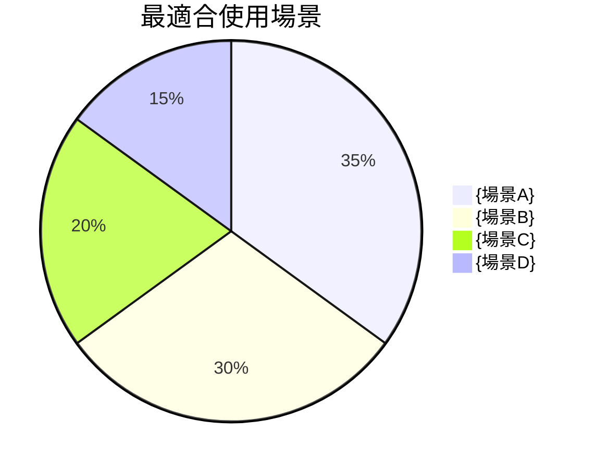

**場景說明**：

| 場景 | 推薦指數 | 說明 |
|------|----------|------|
| {場景A} | ⭐⭐⭐⭐⭐ | {為什麼特別適合} |
| {場景B} | ⭐⭐⭐⭐ | {為什麼適合} |
| {場景C} | ⭐⭐⭐ | {條件限制} |
| {場景D} | ⭐⭐ | {注意事項} |

**採用建議矩陣**：

| 你的情況 | 建議 | 原因 |
|----------|------|------|
| {情況1} | 🟢 強烈推薦 | {原因} |
| {情況2} | 🟡 謹慎考慮 | {原因} |
| {情況3} | 🔴 不建議 | {原因} |

### 7.6 版本演進分析

> **如果專案有 CHANGELOG 或 Git 歷史，分析版本演進**

#### 版本時間軸

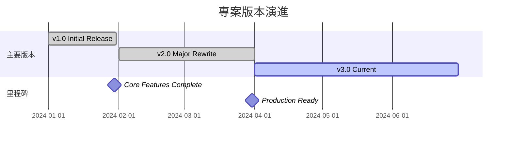

#### 關鍵版本里程碑

| 版本 | 日期 | 重點功能 | 影響 |
|------|------|----------|------|
| v1.0 | {日期} | {功能描述} | 🌱 奠定基礎 |
| v2.0 | {日期} | {功能描述} | 📈 重大改進 |
| v3.0 | {日期} | {功能描述} | 🚀 當前穩定版 |

#### 演進趨勢分析

- **開發活躍度**：{高/中/低}，過去 6 個月有 {N} 次提交
- **版本頻率**：平均每 {N} 週發布一個版本
- **Breaking Changes**：過去 {N} 個版本有 {M} 次破壞性變更
- **未來方向**：根據 Issues/Roadmap，預計 {方向描述}

---

# 🔬 LAYER 3: Deep Dive Reference

> 按需查閱，包含具體程式碼位置與可執行建議

---

## 8. Technical Debt Report

### 8.1 債務總覽

| 類別 | 項目數 | 估計修復時間 | 風險等級 |
|------|--------|--------------|----------|
| 可靠性債務 | {count} | {days} 人天 | 🔴 |
| 安全性債務 | {count} | {days} 人天 | 🔴 |
| 可維護性債務 | {count} | {days} 人天 | 🟠 |
| 效能債務 | {count} | {days} 人天 | 🟡 |
| 測試債務 | {count} | {days} 人天 | 🟡 |
| **總計** | **{total}** | **{total_days} 人天** | - |

### 8.2 債務明細（含程式碼位置）

#### 可靠性債務

| ID | 問題 | 位置 | 風險 | 修復時間 |
|----|------|------|------|----------|
| TD-001 | {issue} | `{file}:{line}` | 🔴 | {hours}h |

#### 安全性債務

| ID | 問題 | 位置 | 風險 | 修復時間 |
|----|------|------|------|----------|
| TD-002 | {issue} | `{file}:{line}` | 🔴 | {hours}h |

#### 可維護性債務

| ID | 問題 | 位置 | 風險 | 修復時間 |
|----|------|------|------|----------|
| TD-003 | {issue} | `{file}:{line}` | 🟠 | {hours}h |

### 8.3 優先級矩陣

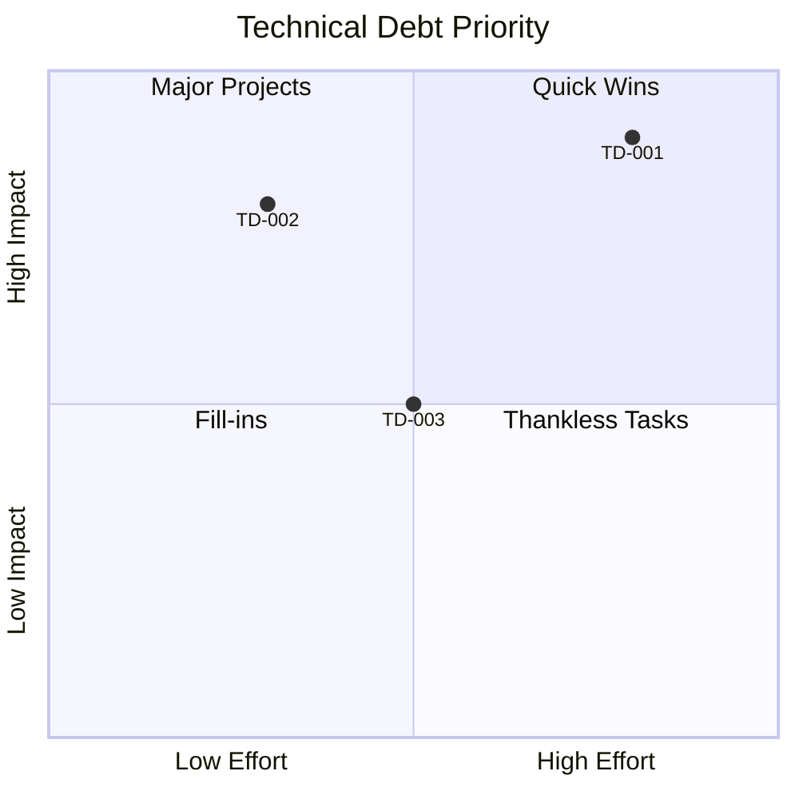

---

## 9. Dependency Analysis

### 9.1 依賴總覽

| 類型 | 數量 |
|------|------|
| 直接依賴 | {direct_count} |
| 間接依賴 | {transitive_count} |
| 開發依賴 | {dev_count} |
| **總計** | **{total_count}** |

### 9.2 模組依賴圖

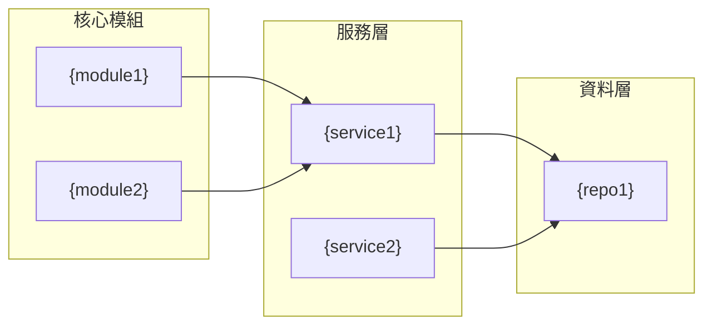

### 9.3 依賴健康檢查

| 套件 | 當前版本 | 最新版本 | 狀態 | 風險 |
|------|----------|----------|------|------|
| {package1} | {current} | {latest} | 🔴 CVE | Critical |
| {package2} | {current} | {latest} | 🟠 落後 2+ 版 | High |
| {package3} | {current} | {latest} | 🟡 小版本落後 | Medium |
| {package4} | {current} | {latest} | ✅ 最新 | None |

### 9.4 循環依賴警告

| 循環路徑 | 影響 | 建議 |
|----------|------|------|
| A → B → C → A | {impact} | {suggestion} |

### 9.5 授權合規檢查

| 授權類型 | 套件數 | 合規風險 |
|----------|--------|----------|
| MIT | {count} | ✅ 無 |
| Apache-2.0 | {count} | ✅ 無 |
| GPL-3.0 | {count} | ⚠️ 可能傳染 |
| 未知 | {count} | 🔴 需確認 |

---

## 10. Security Assessment

### 10.1 安全分數：{score}/100

### 10.2 漏洞掃描摘要

| 嚴重度 | 數量 | 範例 |
|--------|------|------|
| 🔴 Critical | {count} | {example} |
| 🟠 High | {count} | {example} |
| 🟡 Medium | {count} | {example} |
| 🟢 Low | {count} | {example} |

### 10.3 OWASP Top 10 檢查

| 風險 | 狀態 | 說明 |
|------|------|------|
| A01:2021 Broken Access Control | ✅/⚠️/🔴 | {detail} |
| A02:2021 Cryptographic Failures | ✅/⚠️/🔴 | {detail} |
| A03:2021 Injection | ✅/⚠️/🔴 | {detail} |
| A04:2021 Insecure Design | ✅/⚠️/🔴 | {detail} |
| A05:2021 Security Misconfiguration | ✅/⚠️/🔴 | {detail} |
| A06:2021 Vulnerable Components | ✅/⚠️/🔴 | {detail} |
| A07:2021 Authentication Failures | ✅/⚠️/🔴 | {detail} |
| A08:2021 Software and Data Integrity | ✅/⚠️/🔴 | {detail} |
| A09:2021 Logging Failures | ✅/⚠️/🔴 | {detail} |
| A10:2021 SSRF | ✅/⚠️/🔴 | {detail} |

### 10.4 敏感資訊檢查

| 類型 | 位置 | 風險 | 建議 |
|------|------|------|------|
| API Key 暴露 | `{file}` | 🔴 | 移至環境變數 |
| 硬編碼密碼 | `{file}` | 🔴 | 使用密鑰管理 |

---

## 11. 🛠️ Actionable Recommendations（可執行建議）

> **每項建議都包含：問題位置 → 問題程式碼 → 修復範例 → 驗證步驟**

### 11.1 建議摘要表

| ID | 標題 | 類別 | 重要性 | 優先級 | 問題位置 |
|----|------|------|--------|--------|----------|
| REC-001 | {title} | Security | ⭐⭐⭐ | 🔴 | `{file}:{line}` |
| REC-002 | {title} | Architecture | ⭐⭐⭐ | 🟠 | `{file}:{line}` |
| REC-003 | {title} | Performance | ⭐⭐ | 🟡 | `{file}:{line}` |
| REC-004 | {title} | Quality | ⭐ | 🟢 | `{file}:{line}` |

### 11.2 優先級矩陣

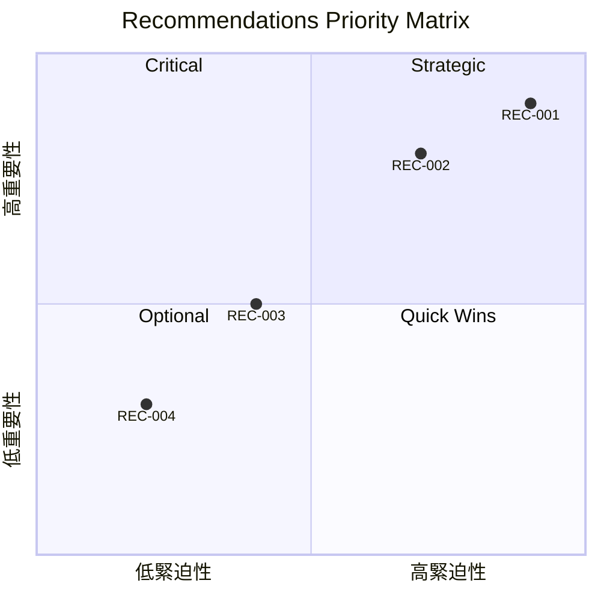

---

### 🔴 立即處理

#### REC-001: {標題}

| 屬性 | 值 |
|------|-----|
| 類別 | 🔒 Security |
| 重要性 | ⭐⭐⭐ 核心 |
| 優先級 | 🔴 Critical |

##### 📍 問題位置
- `{file1}:{line1}`
- `{file2}:{line2}`

##### ❌ 問題程式碼
```{language}
// {file}:{line}
{problematic_code}
//   ^^^^^^^^^ {問題說明}
```

##### ✅ 修復範例
```{language}
// {file}:{line}
{fixed_code}
```

##### 🧪 驗證步驟
```bash
# 1. {步驟說明}
{command1}

# 2. {步驟說明}
{command2}
# 預期結果：{expected}
```

##### ✓ 成功指標
- [ ] {指標 1}
- [ ] {指標 2}

---

### 🟠 短期處理

#### REC-002: {標題}

{同上格式...}

---

### 🟡 規劃處理

#### REC-003: {標題}

{同上格式...}

---

### 🟢 適時處理

#### REC-004: {標題}

{同上格式...}

---

## 12. Appendix（附錄）

### A. 完整目錄結構

```
{詳細目錄結構}
```

### B. 關鍵檔案清單

| 檔案 | 用途 | 重要性 |
|------|------|--------|
| `{file1}` | {purpose} | ⭐⭐⭐ |
| `{file2}` | {purpose} | ⭐⭐ |

### C. 術語表

| 術語 | 定義 |
|------|------|
| {term1} | {definition} |
| {term2} | {definition} |

### D. 分析方法說明

本報告採用以下分析框架：

- **架構文件**: [arc42](https://arc42.org/) + [C4 Model](https://c4model.com/)
- **技術債務**: [SQALE](https://www.sqale.org/) 方法
- **安全評估**: [OWASP Top 10](https://owasp.org/www-project-top-ten/)
- **品質評估**: 自訂 8 維度模型

### E. 分數條生成參考

```
█ = 10 分
░ = 空位

100/100 = ██████████
90/100  = █████████░
80/100  = ████████░░
70/100  = ███████░░░
60/100  = ██████░░░░
50/100  = █████░░░░░
```

---

*此報告由 Claude Code analyze-repo Skill v3.0 自動產生*
*分析日期: {YYYY-MM-DD}*
```

## Mermaid 圖表範例集

### C4 Context Diagram 範例

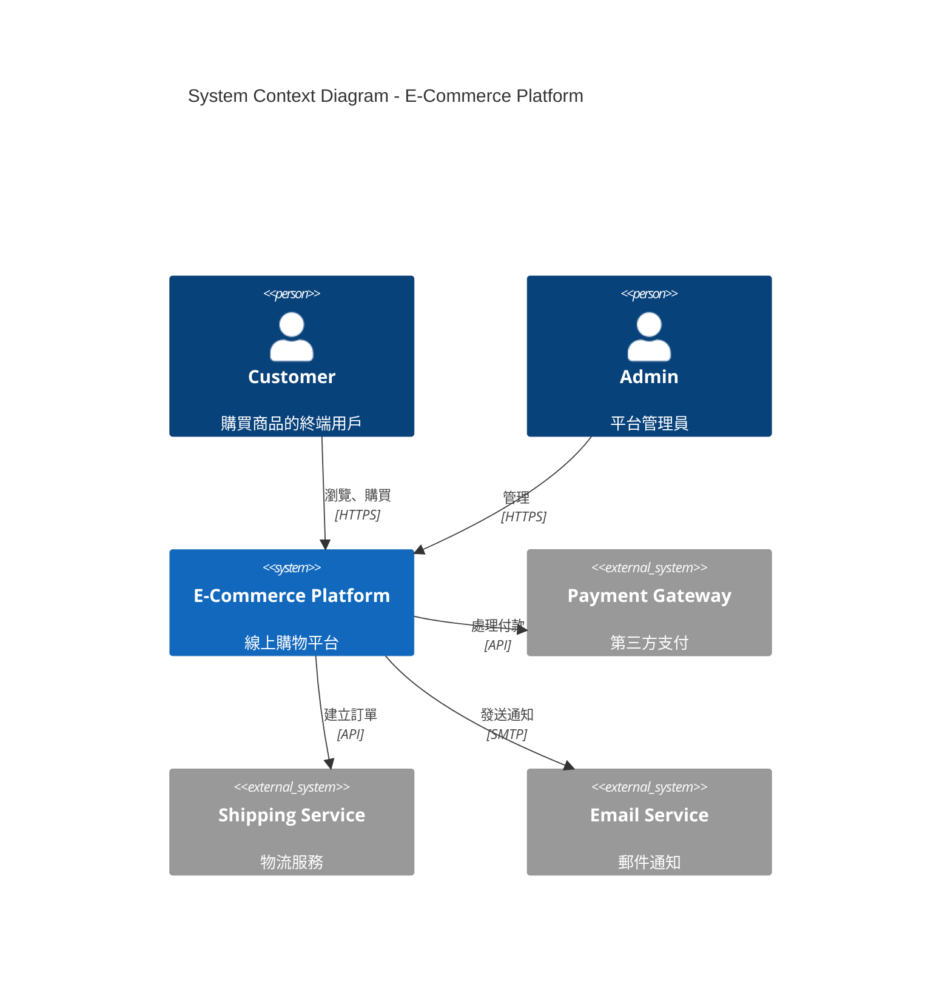

### Quality Radar Chart Alternative

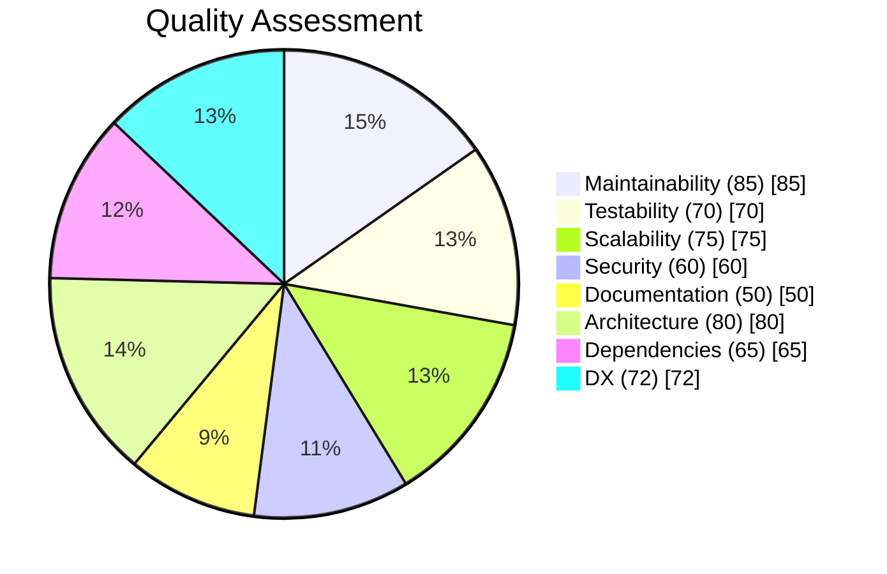

### Technical Debt Trend

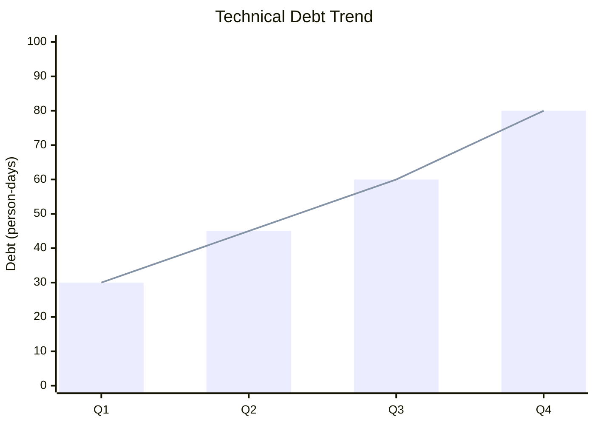

### Dependency Graph

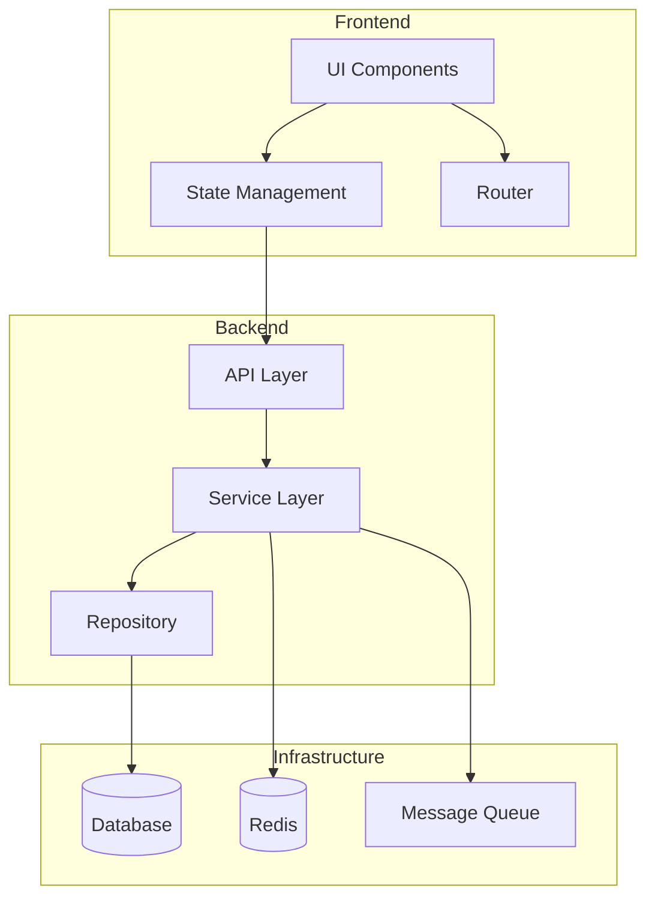
